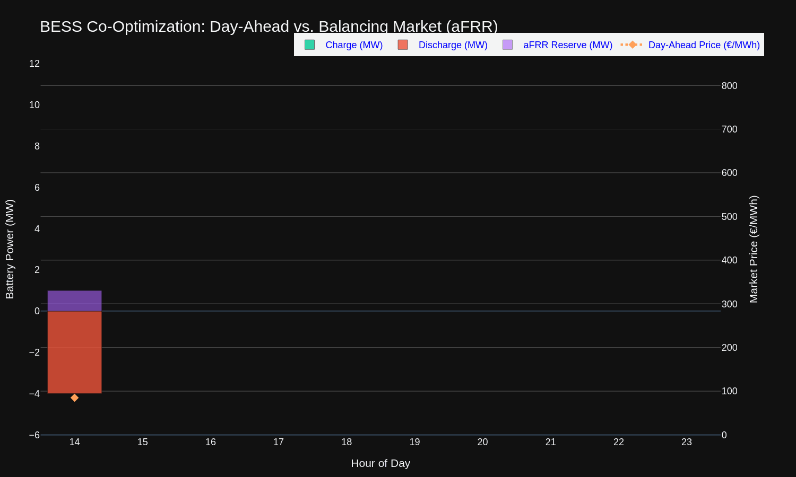

# 🔋 German BESS Co-Optimization Engine

[](https://berlinbeappptimizion-appqbldlvi4w5qdepf3vkbn.streamlit.app/)
[]()
[](https://www.python.org/)
[](https://opensource.org/licenses/MIT)

A production-ready, high-performance Mixed-Integer Linear Programming (MILP) co-optimization engine designed for Battery Energy Storage Systems (BESS) participating simultaneously in the German **Day-Ahead (DA)** and secondary reserve (**aFRR capacity**) markets.

---

## 🚀 Live Demo
Explore the interactive web application deployed on Streamlit Cloud:  
👉 **[Open BESS Co-Optimization Dashboard](https://berlinbeappptimizion-appqbldlvi4w5qdepf3vkbn.streamlit.app/)**

---

## 📊 Key Features
- **Simultaneous Revenue Stacking**: Co-optimizes energy arbitrage in the Day-Ahead spot market with capacity reservation payments in the aFRR balancing market.
- **Advanced MILP Formulation**: Built using Python and optimized via the CBC solver, strictly enforcing physical battery constraints, state-of-charge (SoC) dynamics, and simultaneous power/reserve boundaries.
- **Robust Data Pipeline**: Features automated in-memory fallback mechanisms to gracefully handle missing or empty dataset inputs without crashing.
- **Dark-Mode UI/UX**: Designed with a professional dark aesthetic, custom HTML/CSS metric cards, and dynamic Plotly visualizations featuring customized tooltips and legends.

---

## 📈 Visualizations & UI Components (Interactive Dashboard Demo)
The dashboard provides comprehensive, publication-grade visual analytics positioned right at the forefront:



- **Interactive 24-Hour Dispatch Profile**: Multi-axis Plotly chart displaying charging schedules (Green), discharging profiles (Red), aFRR reserve allocations (Purple), and overlaid Day-Ahead price spikes (Orange dotted line).
- **Custom Themed Tooltips & Legends**: Styled with dark-mode matching backgrounds and high-contrast text for seamless readability.
- **Dynamic Financial Metrics**: Real-time calculated KPI cards highlighting Day-Ahead revenue, aFRR capacity revenue, and total net profit.

---

## 📋 Optimization Results Table
Following the visual analytics, the engine outputs a detailed, hour-by-hour operational and financial schedule:
- **`Timestamp`**: Hourly resolution across the optimization horizon.
- **`DA_Price` / `Capacity_Price`**: Market clearing prices for energy (€/MWh) and aFRR capacity (€/MW).
- **`Optimized_Charge_MW` / `Optimized_Discharge_MW`**: Optimal power dispatched for energy arbitrage.
- **`Optimized_Reserve_MW`**: Allocated capacity for secondary frequency containment reserve (aFRR).
- **`Optimized_SoC_MWh`**: Resulting state-of-charge tracking energy content evolution.

---

## 🛠️ Tech Stack
- **Core Optimization**: Python, PuLP (MILP Modeling), CBC Solver
- **Data Manipulation**: Pandas, NumPy
- **Data Visualization**: Plotly (Subplots, Interactive Dashboards, Custom Layouts)
- **Web Framework**: Streamlit

---

## ⚙️ Mathematical Formulation (Overview)
The optimization model maximizes total revenue over a 24-hour horizon:

$$\max \sum_{t} \left( \text{Discharge}_{t} \cdot \pi^{\text{DA}}_t - \text{Charge}_{t} \cdot \pi^{\text{DA}}_t + \text{Reserve}_{t} \cdot \pi^{\text{aFRR}}_t \right)$$

Subject to:
1. **Power Limits**: Total power allocated to charging, discharging, and aFRR reserves cannot exceed the inverter's maximum power rating.
2. **SoC Dynamics**: Tracking battery energy content accounting for round-trip efficiency ($\eta$).
3. **Mutual Exclusivity / Operational Integrity**: Preventing simultaneous high-intensity conflicting states where physically constrained.

---

## 🗂️ Project Structure
```text
berlin_bess_optimizer/
│
├── app.py                  # Main Streamlit dashboard application
├── requirements.txt        # Python package dependencies
├── README.md               # Project documentation
├── bess_optimization_demo.gif # UI/UX execution demo animation
├── data/
│   └── sample_market_data.csv  # 24-hour DA and aFRR price profiles
└── src/
    ├── __init__.py
    ├── engine_milp.py      # MILP co-optimization mathematical model
    └── utils.py            # Robust data loading and in-memory fallbacks
